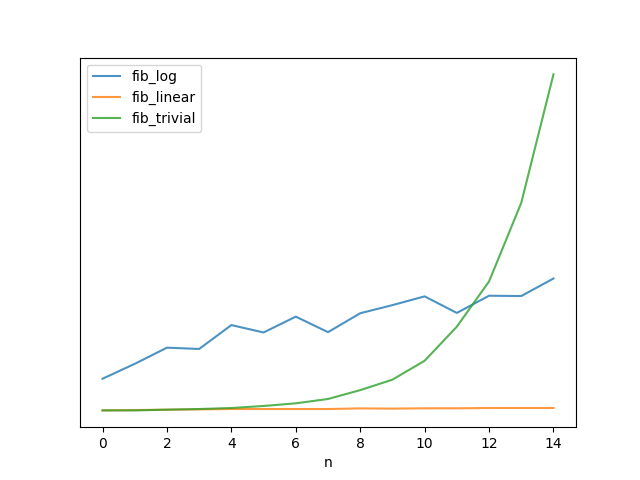

Fibonacci
---------

_There's a logarithmic-time solution?!_


## Background

If you just needed code that generates the nth Fibonacci number, a trivial
implementation might look something like this:

```python
def fib(n):
    if n < 2:
        return 1
    return fib(n - 1) + fib(n - 2)
```

If you've never seen recursion before, this is kind of magical.  But once the
novelty wears off, you notice that generating the 100th Fibonacci number is
basically impossible because the runtime is exponential.



With a little bit of cleverness, we can code a linear-ish solution:

```python
def fib(n):
    if n < 2:
        return 1
    low = 1
    high = 1
    for _ in xrange(n - 1):
        low, high = high, low + high
    return high
```

If you've spent some time with programming interview questions, you might also
know that there's a basically [constant-time solution](https://en.wikipedia.org/wiki/Fibonacci_number#Closed-form_expression),
if you have a bunch of extra square-roots-of-five lying around.


What blew my mind recently was that there also exists a logarithmic-ish-time
solution.

The first bit of knowledge we need is that it is possible to represent the
operation of transforming a Fibonacci number into the next Fibonacci number
as a single matrix multiplication.

Specifically, if we take the column vector f = [F_n-1, F_n], and left-multiply
it by

```
A = [0 1
     1 1]
 ```
then the resulting vector will be f' = [F_n, F_n+1].

(F_n-1 is the n-1th Fibonacci number, F_n is the nth and F_n+1 is the n+1th)

So we have A * f = f'.

And it follows that if we want to advance in the sequence by two, we can just
multiply by A twice:

A * A * f = A * f' = f''
A^2 * f = f''

More generally, we can say that A^n * f will advance the sequence by n.

And from here, all we need is a method that computes A^n in logarithmic time to
get a logarithmic-time Fibonacci number generator.  The bit of intuition that
allows us to do this is that in order to compute e.g. 2^16, we don't need to
multiply 2 by itself 16 times.  We can rely on the fact that 2^16 = 2^8 * 2^8.
[Wikipedia](https://en.wikipedia.org/wiki/Exponentiation_by_squaring) has more.

Indeed this works.


## Let's time some things

If we run the code in `timing.py`, we can see that indeed the logarithmic
solution outperforms the linear on on a large-enough scale by quite a bit:


If we restrict the sequence to just the first 2000 numbers, the runtime looks
even more logarithmic:


Some of the jitter is just noise, and some of it is due to the fact that
calculating powers of two takes fewer operations with our
exponentiation-by-squaring method.

The other thing of note here, and the reason I've said logarithmic-ish and
linear-ish so many times here, is that while the number of operations is indeed
linear or logarithmic, the time those operations take is not.  You can clearly
see that while the orange algorithm is labeled as "fib_lin", the runtime
clearly curves upward.  And that's because the 10,000th Fibonacci number is
well over 2,000 digits long.  Adding and multiplying such big numbers takes
more than one CPU cycle, and depends on the magnitude of the number.
