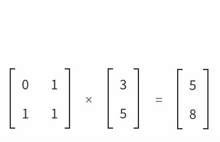

Fibonacci
---------

_There's a logarithmic-time solution?!_

> Note: when I talk about linear-time, logarithmic-time, etc .. I really mean
> linear-number-of-operations.  Not all arithmetic operations run in constant
> time.

### Background

If you just needed code that generates the nth Fibonacci number, a trivial
implementation might look something like this:

```python
# fib_triv.py

def fib(n):
    if n < 2:
        return 1
    return fib(n - 1) + fib(n - 2)
```

If you've never seen recursion before, this is kind of magical.  But once the
novelty wears off, you notice that generating the 100th Fibonacci number is
basically impossible because the runtime is exponential.


With a little bit of cleverness, we can code a linear time solution:

```python
# fib_lin.py

def fib(n):
    if n < 2:
        return 1
    low = 1
    high = 1
    for _ in xrange(n - 1):
        low, high = high, low + high
    return high
```

If you've spent some time with programming interview questions, you might also
know that there's a [constant-time solution](https://en.wikipedia.org/wiki/Fibonacci_number#Closed-form_expression).


### Logarithmic-time

What I didn't know until recently is that there also exists a logarithmic-time
solution.

Let's represent the Fibonacci sequence as

<p align="center"></p>

The first bit of knowledge we need is that it is possible to represent the
operation of transforming a Fibonacci number into the next Fibonacci number
as a single matrix multiplication.

Specifically, if we take the column vector
, and left-multiply it by


then the resulting vector will be
.

So we have .

If it's been a while since you've done matrix multiplication, here's a
refresher, courtesy of
[matrixmultiplication.xyz](http://matrixmultiplication.xyz):




And it follows that if we want to advance in the sequence by two, we can just
multiply by A twice:

<p align="center"></p>

<p align="center"></p>


More generally, we can say that  will advance the sequence by n.

Because exponentiation can be done in logarithmic time, we can now generate
Fibonacci numbers with matching time complexity.

The bit of intuition that allows us to do this is that in order to compute e.g.
, we don't need to multiply 2 by itself 16 times.  We can rely on the
fact that .  Similarly,  can be
expressed as .  Fully reduced, we can write
.  Instead of 16 multiplications, we
only need to do 5.
[Wikipedia](https://en.wikipedia.org/wiki/Exponentiation_by_squaring) has more.

See `fib_log.py` if you're curious.


### Let's time some things

If we run the code in `timing.py`, we can see that indeed the logarithmic
solution outperforms the linear on on a large-enough scale:


Some of the jitter is just noise, and some of it is due to the fact that
doing exponentiation where the exponent is a power of two takes fewer
operations with our exponentiation-by-squaring method.


Let's zoom out a bit more:


The reason I started this readme with a disclaimer is because while the number
of operations is indeed linear or logarithmic, the time those operations take
is not.  You can clearly see that while the orange algorithm is labeled as
`fib_linear`, the runtime clearly curves upward.  And that's because the
10,000th Fibonacci number is well over 2,000 digits long.  Adding and
multiplying such big numbers takes more CPU cycles; timing depends on the
magnitudes of the numbers.
